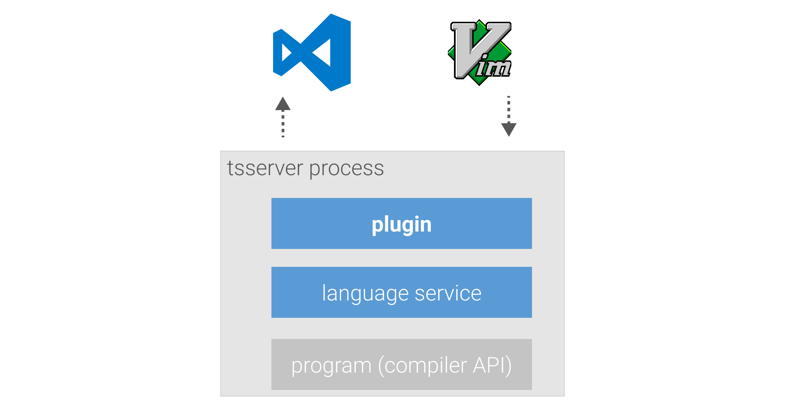

## Which linter do you use with TypeScript ?

### TSLint / ESLint


---


## Announce on 8 Jan 2019

- https://github.com/Microsoft/TypeScript/issues/29288

---


---

## @typescript-eslint :tada:


---

## I'm a TSLint user. How do I migrate ?

---


---

## How to write .eslintrc ?

---

## Google it :innocent:

---

## ~~How to write .eslintrc ?~~

## How to **configure IDE** ?


---

## Options to integrate ESLint to IDEs

- ALE (for Vim)
- Flycheck (for Emacs)
- vscode-eslint (for VSC)
- etc,,,

---

## I've released [typescript-eslint-language-service](https://github.com/Quramy/typescript-eslint-language-service)

---


---

## How to setup

```sh
npm i typescript-eslint-language-service -D
```

```javascript
// tsconfig.json
{
  "compilerOptions": {
    // ...other settings
    "plugins": [
      {
        "name": "typescript-eslint-language-service"
      }
    ]
  }
}
```

#### That's all.

---

## Plugins...? :thinking_face:

---

## TypeScript's plugin system



---

## Why plugin ?

---

## A1. Editor agnostic

Plugin's functions are provided as tsserver features.

---

## A2. Fast

- **Using AST** tokenized by TypeScript language server
  - Only converting from TypeScript AST to estree
  - See also [my slide](https://quramy.github.io/ts-server-side-anatomy/#slide=43) to get incremental parsing
- **Caching ESLint configurations**
  - Purge cache when `.eslintrc.*` files change

